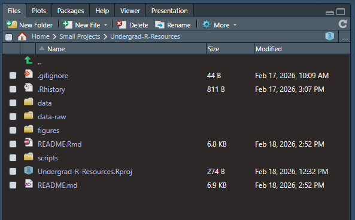

Undergrad R Resources
================

## Intro 💡

*R is hard.* At first especially. But, R can be hard for pros too, and
that’s ok. Programming languages and the tools we use in them are
constantly evolving and changing–often for the better. If you step away
from coding for some time, a week when you are starting out, a month or
a year after getting into the groove, you will come back and probably
feel everything is confusing again. That is also ok. It happens to all
of us, especially ecologists who do not usually think “in code” like
many computer scientists do. **All of this is ok!**

Getting a solid foundation as you learn R and knowing where to look for
help is key. Staying organized and documenting what you are doing and
why is also key. Do these things and I promise, everything will be
ok–probably better than ok!

## Why R? Why GitHub? Why….? 🧐

Well, to be bluntly honest, if you want to do science this is now the
requirement. A few years ago, if you knew how to do a bit of R coding,
you were primed for getting that postdoc position. Then, a few years
later it was expected for incoming PhD students, now if you want to be
competitive for a MS position? You guessed it, you need to be proficient
in R, and GitHub doesn’t hurt either. Proficient doesn’t mean an expert,
though. It means you know your way around, can access data, tidy that
data, clean it, summarize it in tables/figures, and know how to fix
errors and where to look for advise. That is totally achievable.

**So, why R?** Doesn’t Excel do the same things? Kind of….for some
things. Can Excel find the min/max/mean, make so graphs, and do some
calculations–sure. But R is so much more. R is free, open source, is way
more powerful, and has a community of people always working on making
new things and fixing what’s broken. But most importantly, R makes you
work **reproducible**. Reproducability is now key to all science. I
should be able to take someone else’s data, run their script (the code
they wrote), and get the same results they did–that’s reproducuability.
This ensures others can check our work, expand on what we did, and be
transparent about how we handled our data.

In R, we take data, run it through a script (the code), and produce
results. We can do this again and again, and we should get the same
result. Every data cleaning step, tidying step, analysis step, and
figure production is written out in code. This is where things really
differ from Excel. In Excel you will need to do a lot of individual
tasks, probably saving a munch of data files in between with weird names
like “data_clean.csv”, then “data_clean_v2.csv”. Then when you are
nearly finished, you will realize you forgot something or need to redo
something else. Which file do you go back to? Do you remember what you
did exactly? Can you reproduce what you did previously? I’m pretty sure
the answer will be “no” – because I’ve done that and you probably have
to in some way or another. R scripts are designed to take the raw data,
clean it, do whatever else you need, and give you a product at the end.
All the steps are there to see, to be explained, and to be runable again
and again as we tweak things towards our final product. That’s why R is
important to learn and use (among many other things that is).

**Why GitHub?** Good question. It’s been the industry standard for
computer scientists (think software developers, game designers) for a
long time, and its now becoming the best practice for R coding as well.
GitHub is the Google Docs of coding. Basically it is “version control”
and tracks the changes in code between versions. If something was
working before, and its not working now, you can see what changed in the
code. Like Google Docs, its also cloud storage for your code. If your
computer up and dies, your code is safe and sound in the cloud on
GitHub. This has saved many an R coder before and will in the future
too. Do you need to totally understand Git and GitHub to use it? *No,
definitely not, that’s mostly for developers and industry folks*. Do you
need to use it in your coding workflows for ecological data? *Yes* [^1].
Learn and use it now to set yourself up better for the future.

## R Building Blocks 🧱

### R Projects

When you produce work for a class, you probably keep things in folders.
Like “Documents/Cornell/Ornithology/Lab_1/” where all your data and
write ups and such for Lab 1 are stored. If you want to work on Lab 1,
your fundamental unit would be the Lab_1 folder—everything you need for
Lab 1 is in there. In R, our fundamental unit is called a “project”. A
project is a folder that contains everything we need to do our
analysis—the rest of our computer does not matter, its like it does not
exist. When you create a project in R, it creates a folder and makes a
file with the folder name with the extension `.Rproj` . This is the
magic. Double click that file and your project loads right up and R now
knows that we are working on this thing in this location and we only
need to worry about what is here. If you use a project, finding files
and saving things will be so much better, trust me! No more, “where did
that save?”, “where did I put that data?”. Its all right here, in the
project. And, the best part? Throw this on github, have someone else
clone it, and they are good to go! All the file paths will work. They
won’t need to change your code where you read the data in from your
“C://user/Documents/I_want_this_folder/… .csv” to
“C://user/Document/well_I_wanted_to_use_this_folder/… .csv”. Again,
reproducability!

Projects are just folders with a .Rproj file int it. Each project should
be a——well, a project. We have an ecological question we want to answer,
that’s our project. Our R project should reflect that. A data analyst
has lots of different R projects, each with its own task. You don’t want
a huge R project that spans multiple questions or multiple ideas. We
want manageable units that can be self contained, runable from data to
product, and be sharable! So, you might have a project
`2026-FeederWatch-ChickadeesTrends` for looking at trends in chickadee
abundance over time, and `2026-NestWatch-RobinSuccess` for looking at
nesting success of Robins. Each will have starting data, analysis code,
and final products. Even if you share starting data, or even some
analysis, different main questions use different projects:
`2026-NestWatch-RobinSuccess` and `2026-NestWatch-NestUsurption` may
both share the NestWatch dataset, but one might be asking what species
usurp (take-over) nests of other species while the other is asking how
has American Robin nesting success changed over space and time.
Different question = Different R project. And everything we need to get
from data to our final product should be in our project.

### R Scripts

The other main unit in R is the “script”. Scripts hold code, its where
the magic happens. Scripts tell R where to get data from, what to do
with it (and how), and how we want to see what we produced along the
way. Think of the script as the instruction manual for not only R, but
also you and someone else. That’s the today you, the tomorrow you, and
the you ten years from now. Scripts contain code to do things, but they
also contain comments! Commenting out your code makes a good coder
great! Code is for the computer, but comments are for humans.

``` r
# This is a comment, the line starts with a #
# The next line is code, it doesn't start with a #
1+2

1+2   # you can add comments after code too!
```

### Project Structure 🗂️

Organization is key—for most things, R projected included. And like most
things, there are some standard conventions that make things easier and
more familiar when working collaboratively. If stop lights were red in
one state and blue in anther, that would be confusing, right? Same thing
for R projects. We usually use the following structure:



Here we see in R the contents of our project folder. This folder lives
on my computer in the folder “Small Projects” and the project is called
“Undergrad-R-Resources”. We see everything in that folder. Lets break
down what is here, some of it I made, some of it is automatic, but all
of these are standard practice among R coders who make good,
reproducbale code workflows.

- Undergrad-R-Resources.Rproj This is the project file, the glue that
  holds everything together

- README.Rmd Where I am typing right now, it explains what the project
  is about

- README.md This is what actually renders on the github page form the
  README

- .Rhistory Not really that important

- .gitignore Tells github what to not worry about (like data to large or
  sensitive)

- data-raw Folder holding RAW DATA ONLY (your starting point, your
  fallback)

- data Folder holding any processed data (cleaned, subset, etc.)

- scripts Folder holding scripts (each should be numbered and named
  well)

- figures Folder holding all your figures (formatted tables often go
  here too)

- (docs) Sometimes you may see a docs folder, for docs like manuscripts

- (spatial) If you have spatial data, keep that separate, those files
  are huge

- (results) Sometimes used to store final products of analyses (like
  final data)

The .Rhistory, .gitignore, README, and the project file are all
automatically created when you create the project or get it setup on
GitHub. Don’t change their location. You create the folders and populate
them with the data and code. The important thing here is everything
lives in a folder and each folder has a purpose. And the most important
thing is that `data-raw` and `data` are different. Your starting data
(raw data) goes in `data-raw`. This is your starting point and your fall
back. It doesn’t matter if your starting data is technically
pre-processed (most data is to some degree) or is truly raw—all starting
data that you are working with goes here. We read in the raw data,
transform it in some way (like filtering or cleaning) and we save that
data as a new file in `data`. Never write over files in `data-raw` and
never save processes data in `data-raw`—NO EXCEPTIONS. (As a data
scientist I don’t choose many hills to die on, but if there’s one then
this is the one).

`scripts` will hold all your scripts, from downloading data, to
cleaning, to analysis, and to producing your final thing. That thing
could be some figures, or some tables, or a combination of both. You
should have multiple scripts. Your project is your overall question.
Your individual scripts contain tasks that are necessary to answer that
question. I usually have at least three scripts. Each script should be
numbered so you know what order they happen in and should be names in a
way that tells you what question and what task are we working on. I
usually use the following convention:

- 01-ShortProjectName-dataclean

- 02-ShortProjectName-specificanaysis

- 03-ShortProjectName-specificfigure

By looking at the file name, we can see the order in which we need to
run the scripts, what question they answer (in case they end up in a
weird spot outside our project folder), and what is being done in the
script. Data cleaning scripts take the raw data, process it into
something usable for our question and save that new file in `data`. Then
any analysis scripts use that processed data file, do an analysis,
produce a or many results, and store those results. Different analyses
should have different scripts. Then figure scripts take results and
produce nice looking products like formatted tables or figures. If you
want to change the font size of your figure, you don’t necessarily want
to rerun all your analyses. Keeping a separate figure script is
unbelievably helpful.

## Coding in R

There are tons of tutorials and courses out there about learning to code
in R. I could not do any of those justice my reproducing them here. You
also should never learn to code form just one person. There tons of ways
to learn to code and a ton of ways to do the same thing.

### R “dialects”

For example, if R is a language, there are two main dialects: `base R`
and `tidyverse (or dplyr)`. You can get both to do the same thing, just
in different ways and different difficulty levels. I use both, and
switch back and forth depending on the task. Some people uses only base
(it has few dependencies and is less likely to break in the future).
Dplyr reads more like text than code, is built around chaining functions
togther to combine many different individual tasks, and encompass the
idea of “tidy data” and “data carpentry”. Tidy data is a hard concept to
explain, but this usually means “vectorizing” the data—turning many
columns into fewer. For example, lets say you have a dataset about tree
DBH overtime. You could have a column for the tree ID#, a column for the
measure in 2020, then another for 2021, and so on. This is easy for a
human to read, but not a computer. Tidy data principles say to “pivot”
(transform) this data into 3 columns: tree_id, year, and DBH. You can
learn more than you ever wanted about tidy data here:
<https://r4ds.had.co.nz/tidy-data.html>

To get a sense of what these two dialects usually look like, lets show
an example. Lets say we have some data in a file called `field_data`. It
has tree_id, year, and DBH as columns. We want to filter all the data to
only get the lines where data was collected in 2026. Base R code usually
looks something like this:

``` r
filtered_data <- field_data[ , field_data$year == "2026"]  # get all rows where year is 2026
```

In the tidyverse, the same thing would look like this. The `%>%` is
called a pipe, and it passes data along, in this case taking
`field_data` and passing that through the function `filter()`:

``` r
filtered_data <- field_data %>% filter(year == "2026")  # get all rows where year is 2026
```

Both do exactly the same thing, just in different ways. If you see `%>%`
you are seeing tidyverse (dplyr) code. If you don’t, and especially if
you see `[ ]` that is probably more towards base R code. Knowing this
distinction may help you understand what you are looking at and how to
trouble shoot/know what to google. Adding “base r” or “dplyr” in a query
usually helps get you towards what you are looking for.

### Learning to Code

I do not have the bandwidth to put together a full tutorial from
scratch. So, here is the exact place I learned. This is a course from
Ethan White, a professor at University of Florida. He’s an ecologist,
data scientist, and all around cool dude. And he was cool enough to make
his course publicly available for everyone. It has exercises,
“lectures”, and instructional videos (which are actually fun to watch):

- 🤩[Data Carpentry for
  Biologists](https://datacarpentry.github.io/semester-biology/schedule/)

I suggest working through weeks 1-5 and 13 as a starting point. If you
work with spatial data or do repetitive tasks, check out the spatial or
repeating things sections.

There are a ton of other tutorials and open access courses out there.
Feel free to explore!

### Errors / Warnings / Messages

At some point you will see warnings or errors down in your console.
Messages usually just give you some more information. You see these a
lot when loading a package, such as “Build using R version …”. Warnings
are sometimes totally ok and expected (happens when using spatial data
pretty often). But warnings should be taken seriously, they may actually
be warning you that R did do the task you asked, but the results may not
be what you were expecting. Errors will stop you code run. Which is
good! That means there was something that broke. Some error messages are
helpful and will guide you to the solution. Some are generic and totally
not helpful. You can copy the error message and paste that into google.
Responses in stackoverflow are usually very helpful, and usually many
people have posted about commonly experienced error message. Another
option is to use an LLM.

#### Using LLMs

I want to start with cautionary warning. LLMs can help you code, and are
getting better, BUT they are not always right. They can and will at some
point take you in loops “hallucinating” functions that do not exist or
not solving the problem. You should also ALWAYS be careful what
information you give the LLM. They are always being trained off of what
you give it. Never give an LLM any sensitive data. That begin said they
can be very helpful when used correctly. But you will never get good at
coding if you rely on it solely.

When asking an LLM for help, always start with “I am coding in R. I have
a dataframe, and I an trying to \_\_\_\_\_. My data looks like
\_\_\_\_\_.” LLMs work well for doing if you give small examples and
focus on what is important. You never have to tell it what you are
really investigating, you can be super vauge. For instance using our
tree example again. I could say “I am coding in R. I have a dataframe of
data where one of several columns is year. Can you help me write some
base R code to keep only lines where year is 2026?”

LLMs can be pretty helpful in decoding error and warning messages. Paste
in your error or warning and it might be able to tell you what you did
to produce the error. It also helps if you put the code that produced
the error.

<u>***Cautionary Note:***</u> Not all code LLMs produce will work (or do
what you thought it would do). Same thing for code you find online.
Malicious code snippets do exist online. As a rule, you should always be
cautious of running code you do not know what it does. This is hard when
you are starting out. If you are unsure, you can google it and see if
multiple people have “upvoted” a response. That is usually a good
indication the code is fine and is more likely to work.

[^1]: ok, you got me. Technically no, but YES. Trust me, just do it!
